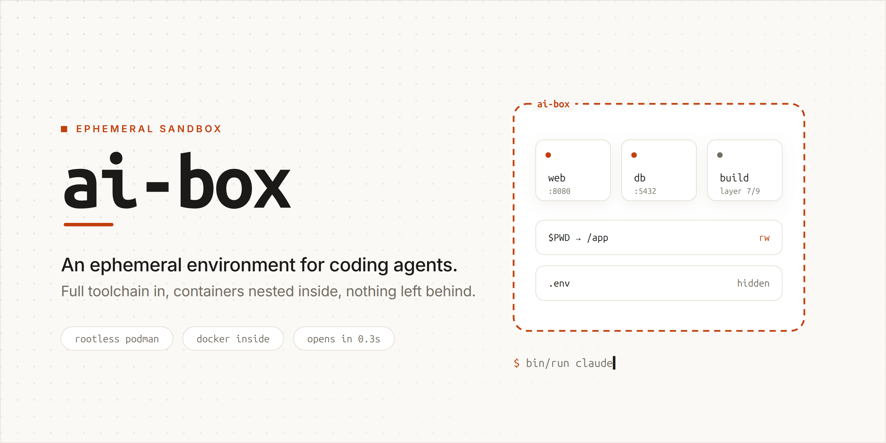

<picture>
  <source media="(prefers-color-scheme: dark)" srcset="img/cover-dark.png">
  
</picture>

# `ai-box`

An ephemeral environment for coding agents. It carries the toolchain the agents
reach for -- Node, Python, Chrome, Playwright, ImageMagick, whisper -- and it
can run containers inside itself, so an agent can `docker build` and
`docker compose up` the project it is working on without any of it touching the
host. Everything it creates is discarded when you leave.

## What the host needs

No Docker, no root daemon, no `/dev/kvm`. The environment runs under **rootless
Podman**, so the host needs Podman and the pieces rootless mode depends on:

```bash
sudo apt install -y podman uidmap passt slirp4netns crun catatonit
```

Plus, from the kernel and your user account:

| requirement | why |
|---|---|
| cgroup v2 | Podman's rootless mode; default on any current distro |
| unprivileged user namespaces enabled | the whole sandbox is one |
| `/dev/fuse` (`modprobe fuse`) | passed in, so the inner engine can stack an overlay on the sandbox's own overlay |
| `/dev/net/tun` (`modprobe tun`) | passed in, for the inner network namespace's uplink |
| **at least 65536 subuids/subgids** for your user in `/etc/subuid` and `/etc/subgid` | the inner engine carves its own range out of the one the sandbox is given. A short range is the one host-side setting that quietly breaks nesting |

Rather than checking by hand:

```bash
bin/configure      # installs the packages, loads fuse/tun, grants the subuids
bin/missings       # or just tell me what is missing, change nothing
```

`bin/configure` is idempotent -- every step checks first, so re-running it is a
no-op that reports what is already in place. `bin/configure --dry-run` prints
what it would do. Both are safe under `sudo`: the subordinate range is granted
to `$SUDO_USER`, not to root.

Verified on Ubuntu 26.04, kernel 7.0, Podman 5.7 on the host.

If Podman prints `OCI Runtime crun is in use by a container, but is not
available` on every command, `crun` is missing while existing containers still
name it. Install it first, then clear the stale records:

```bash
sudo apt install -y crun
podman rm -af
```

## Usage

```bash
bin/configure      # install what the host is missing (idempotent)
bin/missings       # report what is here and what is not; --deep also runs a
                   # container inside the box
bin/build          # build the image (tag: ai-box) and fill data/extras
bin/images         # list the shared image store; add: bin/images mysql:8.0

bin/run            # open the box on the current directory
bin/run claude     # ...and go straight into an agent
bin/run make test  # ...or run one command and exit
NOTES=~/path/to/notes/20260927_005300 bin/run claude
                   # ...with a Visual Notes note at /notes
GIT=commit bin/run claude
                   # ...letting the agent commit, push and pull the branch
                   # you are on, through the host; see Commit, push and pull

bin/usage          # rate-limit usage of the agents the box is logged in to,
                   # Claude and GPT side by side; reads data/, starts nothing
```

`bin/run` refuses to start from `$HOME`, from any directory that contains it,
or from `/`, because `$PWD` is handed to the box read-write and from there
that would be every dotfile and key at once. Paths are resolved first, so a
symlink does not get around it.

### What `bin/run` gives the box

| path | mode | |
|---|---|---|
| `$PWD` → `/app` | rw | the project; the only writable host path |
| `$PWD/.git` | **ro** | mounted over the writable workspace, when present; always |
| `$PWD/.env`, `$PWD/.env.*` | hidden | each replaced with `/dev/null`, so secrets never enter the box. `AI_BOX_MASK="a.pem b.json"` hides more |
| `~/repos` → `/repos` | ro | |
| `$NOTES` → `/notes` | rw | a Visual Notes note, when `NOTES` is set |
| `data/claude{,.json}` → `~/.claude{,.json}` | rw | so the agent keeps its login and history |
| `data/codex{,.json}` → `~/.codex{,.json}` | rw | same |
| `data/images` → `/var/lib/shared` | rw | the shared image store, when it exists |
| `data/extras` → `/opt/extras` | overlay | browsers, whisper model, Chrome, `claude`, `codex`; writes end with the box. See [Browsers, model and agent CLIs](#browsers-model-and-agent-clis) |
| sockets → `/run/git` | ro | with `GIT=commit`: `commit`, `push` and `pull` ask the host |

Agent state is the box's own, kept out of your home dotfiles: the box logs in,
keeps its history and rewrites its config without touching the `~/.claude` or
`~/.codex` you use outside it. `bin/run` creates the directory and the two JSON
files on first run, because a bind mount whose source does not exist would
otherwise be created as a directory and the agents want files there.

Those paths are relative to **this repo**, not to the directory you run from --
see [Where the box keeps its state](#where-the-box-keeps-its-state).

`--shm-size=2g` is set for Chrome/Playwright. `$PWD/.git`, `$PWD/.env` and
`~/repos` are mounted only when they exist, so a bind mount never silently
creates an empty directory in your home.

### Commit, push and pull

```bash
GIT=commit bin/run claude
```

`.git` stays read-only. A box that could write it could rewrite history, move
or delete any branch and drop your stashes, and an agent did: it rewrote
commits you had already pushed. So the host does the git work, and the box
asks. `commit`, `push` and `pull` inside the box each connect to a relay
`bin/run` starts beside it, and the host runs a fixed script in the workspace,
for the branch checked out when the box started:

| in the box | on the host |
|---|---|
| `commit <file.patch>` | the patch applied on `HEAD` and committed; a `git format-patch` email brings its message, a plain diff takes `-m <message>` |
| `commit -m <message> <path>...` | the same, with the patch made in the box from those files |
| `push` | `git push --no-follow-tags origin refs/heads/<branch>:refs/heads/<branch>` |
| `pull` | `git fetch` of `<branch>` into `origin/<branch>`, then `git merge` |

One patch, one commit. The host applies it to a scratch index on `HEAD`, so
neither your staging nor the working tree is read or changed: the files
already hold the change, and the patch is what gets recorded. Commits are
yours: your `user.name`, your hooks. A patch that does not apply to `HEAD` as
it is now is refused, and so is one touching a file the box sees masked
(`.env`, `AI_BOX_MASK`). From paths, the agent names every file, new, changed
or deleted; no globs, no `-a`. No force, no other branch, no tags, no amend,
rebase or reset: there is no command for them. If you switch the branch on the
host, `commit` and `pull` refuse until you switch back.

`pull` merges on the host: a fast-forward or a merge commit goes through. A
conflict does not. `pull` undoes the merge, lists the files, tells the agent
to stop and ask you, and exits 2. A rejected push (the remote moved on) comes
back to the agent as git printed it; `pull` and a second `push` follow.

`git commit`, `git push` and `git pull` in the box say which command to run
instead. The relays end with the box.

What it needs:

- a branch checked out on the host; `bin/run` stops on a detached HEAD;
- `socat` on the host (`bin/configure` installs it);
- a push and a fetch that work from your terminal with no passphrase typed:
  the relays have no terminal to ask on. ssh-agent covers it.

### Where the box keeps its state

Everything the box keeps between runs lives in this repo, under `data/`:

```
data/claude/  data/claude.json     the agents' state and logins
data/codex/   data/codex.json
data/images/                       shared image store, for inner docker run
data/extras/                       browsers, whisper model, Chrome, agent CLIs
data/refresh                       the ISO week of the last finished build
```

The names lose their leading dots on this side of the mount -- nothing here is
hidden from the person who owns it, and `ls data/` should show what the box is
keeping. They arrive as `~/.claude` and `~/.codex` inside the box.

This is not an app you install once. You pull the repo and rebuild it, often
more than once a day, so its state belongs beside the tree it was built from:
one directory holds all of it, `rm -rf data` is the whole reset, and it leaves
nothing anywhere else on the host. `data/` is gitignored, and `.dockerignore`
keeps it out of the build context.

The path is anchored to the scripts, not to `$PWD`, so `bin/run` from any
workspace finds the same state. Two clones are two boxes: separate logins,
separate image stores. Deleting a clone deletes its state with it -- and a
fresh clone starts logged out, so keep the clone you use.

The other side of state living in an ignored directory: `git clean -xdf` in
this repo takes the logins and the image store with it, and `data/extras`,
which the next `bin/build` downloads again (3.5 GB). `git pull` and a
rebuild, the daily path, leave `data/` alone.

### Browsers, model and agent CLIs

They are not in the image. Playwright's browsers, Cypress's Electron, the
whisper model, Chrome and the two agent CLIs are 3.5 GB of the 6 the image
used to be, and they change at their own pace: the CLIs daily, the rest
weekly or less. So they live in `data/extras`, each under its version:

```
data/extras/
  versions          what is here, name=version, as in /etc/ai-box/versions
  ms-playwright/    chromium-1234/, firefox-1538/, webkit-2336/, headless shell
  cypress/          14.5.4/
  huggingface/      the whisper model
  chrome/           155.0.8059.39-1/, current -> 155.0.8059.39-1
  npm/              2.1.292-0.160.1/ (claude-code-codex), current -> ...
```

- **`bin/build` fills it**, at the end, by running `extras-fill` in the new
  image, and writes its whole output to `data/logs/build-<time>.log`. What
  is there at the right version costs nothing: a daily build installs a new
  Claude or Codex beside the old ones and moves `npm/current`, and the image
  itself, unchanged, is not copied again. The first build of a week also
  takes a new Chrome. Each entry is checked (a real launch, a real
  transcription, `--version`) before it is renamed into place.
- **`bin/run` mounts it** at `/opt/extras` as an overlay (`:O`): the host's
  folder is never written by a box, and what a box writes there -- a
  project's own `npx playwright install` -- ends with it. Without the agent
  CLIs `bin/run` stops and says to run `bin/build`; without the rest it starts
  with a warning, since the fill installs the agents first.
- **Inside, nothing moved.** `claude` and `codex` are on the `PATH`;
  `PLAYWRIGHT_BROWSERS_PATH`, `CYPRESS_CACHE_FOLDER` and `HF_HOME` point into
  `/opt/extras`; `/opt/google/chrome` and `/usr/bin/google-chrome` lead there.
  `google-chrome` and `transcribe` say "run bin/build" when their part is
  missing.
- **Old versions** stay three days after they stop being current, for boxes
  started before the fill (`KEEP_DAYS`), then the next fill removes them.

The design and its reasons: [notes/extras.md](notes/extras.md).

### Limits on the box

The inner engine has no cgroups of its own, so nothing inside the box can
limit itself. `bin/run` limits the box as a whole instead, through whatever
cgroup controllers systemd has delegated to your session (`bin/missings`
reports which):

| variable | default | |
|---|---|---|
| `AI_BOX_PIDS` | 4096 | `--pids-limit`; a fork bomb inside stops here |
| `AI_BOX_MEMORY` | three quarters of the host's RAM | `--memory`; the box is OOM-killed, the host is not |
| `AI_BOX_CPUS` | unlimited | `--cpus` |

Set one to `0` to lift it. `bin/run` also puts a real init at PID 1
(`--init`, Podman's own `catatonit`) whenever the host has it, so orphaned
processes are reaped and `podman stop` ends the box at once.

### Helpers on the `PATH`

`files/bin/` is installed to `~/bin` inside the box, so these are just there:

| | |
|---|---|
| `hwdata` | CPU, memory and disks of the host underneath |
| `diskusage` | one CSV row per real filesystem: inodes, bytes, percentages |
| `diskusage-warn` | the same, filtered to whatever is over 85% |
| `now` | timestamp, for pasting into notes |
| `g` | recursive `ag` search: `g pattern` |
| `templ` | the skeleton these scripts start from: `templ > new && vi new` |
| `extras-fill` | fills `/opt/extras`; `bin/build` runs it with `data/extras` mounted writable |
| `commit` | one patch, one commit, through the host: `commit <file.patch>` or `commit -m <message> <path>...`; a `GIT=commit` box only |
| `push` | push the branch the box was started on, through the host; a `GIT=commit` box only |
| `pull` | fetch that branch and merge it, on the host; stops on a conflict; a `GIT=commit` box only |
| `git` | git itself, except that `git commit`, `push` and `pull` point at the three above in a `GIT=commit` box |

`hwdata` reports what it can: `parted` is not in the image, so the partition
table check is skipped. `g` with no argument wants an X clipboard the image does
not have and says so. Scripts that only make sense on a real host -- `netdata`,
`osdata`, `showmyip`, `showufw` -- live in `files/bin.host/` and are not copied
into the image.

There is no database server in the image. MySQL, Redis and MinIO run as
containers, and `bin/images mysql:8.0 redis:7 minio/minio` on the host puts
their images in the shared store so `docker run` inside needs no pull.

## Running containers inside it

`bin/run` used to be `docker run --rm -it a`, and `docker` inside it did not
work: the image installs `dockerd`, but `dockerd` needs `--privileged`, and
`--privileged` is host-root-equivalent. Binding `/var/run/docker.sock` was the
other usual answer, and that is worse — the containers are then siblings on the
host, they outlive the environment, and `--rm` stops meaning anything.

The environment now runs under **rootless Podman** and the engine *inside* it is
Podman too -- Ubuntu 24.04's `podman` 4.9 and `podman-compose` 1.0.6, not the
5.x on the host, so do not expect 5.x-only features or the newest compose-spec
keys inside. `podman-docker` provides a real `docker` command, so nothing you
type changes.

## Why this clears every constraint at once

The decisive property is that **Podman has no daemon**. Docker-in-Docker spends
its first second booting `dockerd` — the old entrypoint polled for it for up to
ten seconds. With nothing to boot, that whole phase disappears, which is how the
environment opens in a quarter of a second while still giving you a working
`docker`.

| requirement | result |
|---|---|
| `docker run` inside | works |
| `docker build` inside | works |
| `docker compose` inside | works — services up, published ports reachable, and services resolve each other by name |
| opens in < 1 s | **0.25–0.40 s** (5-run spread on a from-scratch build), well under budget |
| terminated ⇒ environment gone | SIGKILL with 2 inner containers, 3 inner images and 220 MB of nested state: host storage byte-identical, no stray mounts, no leftover netns, no held ports, workspace untouched |
| no `--privileged`, no docker socket | neither appears; the sandbox is rootless and unprivileged, and no capabilities are added |

Bonus: files you create in `/app` come back owned by **you**, not by `root`.
`ubuntu` inside is your own uid outside.

## What had to change

**`Dockerfile`** — `docker-ce`/`containerd.io` out, `podman` + `podman-docker` +
`podman-compose` in, plus four things that are easy to miss:

- `netavark`, `aardvark-dns`, `nftables` are **Recommends**. The image builds
  with `--no-install-recommends`, so they were silently absent, and the failure
  mode is not obvious: compose comes up and published ports work, but services
  cannot resolve each other by name. `aardvark-dns` is that resolver; netavark
  shells out to `nft`.
- `setcap cap_setuid+ep` on `newuidmap`/`newgidmap`. Ubuntu ships them
  setuid-root, Fedora ships them with file capabilities, and **only the
  capability form can write a nested `uid_map`**. Without it the inner `docker`
  dies with `newuidmap: ... Operation not permitted`.
- `/etc/subuid` + `/etc/subgid` for `ubuntu`, carved out of the range the outer
  rootless container already maps.
- The nesting config goes in `/etc/containers/containers.conf.d/`, **not** over
  `/etc/containers/containers.conf` — replacing that file discards the distro's
  own settings, including where Podman looks for `netavark`.

`usermod -aG docker ubuntu` is gone: there is no daemon and no socket, and
membership in a `docker` group was itself root-equivalent.

**`files/docker-entrypoint`** — nothing to start and no poll loop to wait
through; `DOCKER_DIND` is gone. It now creates `/run/user/1000` before dropping
privileges, because an inner engine with no runtime directory of its own drops
a pause-process file into `$PWD` — straight into your mounted workspace.

**`bin/run`** — `podman run` with the flags that make nesting work. Each is
there for one specific reason; see the comments in the script.

**`bin/build`** — `docker build` → `podman build`. All 14 `--mount=type=cache`
BuildKit cache mounts work unchanged.

## Two things that behave differently

- **No cgroup limits inside.** `docker run --memory=...` in the environment is a
  no-op, because the sandbox's `/sys/fs/cgroup` is read-only. Limit the
  environment as a whole from outside instead.
- **`docker buildx` is gone.** It was only ever called to print its version.
  `docker build` and `docker compose` are unaffected.

## One of each

There used to be four Chromiums in the image and two ImageMagicks. Now:

- **One Chrome.** `google-chrome-stable`, unpacked into `data/extras/chrome`,
  is it. Puppeteer is pointed at it with
  `PUPPETEER_EXECUTABLE_PATH` instead of downloading its own copy, which is the
  same browser a couple of patch releases behind. `puppeteer.launch()` needs no
  argument; `extras-fill` asserts `executablePath()` resolves there.
- **One Chromium for Playwright**, installed with `--no-shell`. A headless
  launch asks for the full browser's headless mode with `channel: 'chromium'`
  rather than a second 262 MB build whose only job is to be the headless one;
  a plain `chromium.launch()` looks for that build and fails.
- **One headless shell, for a project with its own Playwright.** A suite that
  runs the `@playwright/test` its lockfile pins and launches it plainly needs
  the shell of that release (`PLAYWRIGHT_SHELL_VERSION`), 262 MB.
- **One ImageMagick, version 7.** The apt package (version 6) is gone. `magick`
  is the AppImage; the legacy names — `convert`, `identify`, `mogrify`,
  `composite`, `montage`, `compare` — are a wrapper that runs `magick <name>`,
  so each is the same ImageMagick as `magick`. `convert` still works, with
  upstream's one-line deprecation warning on stderr. (The AppImage's own
  launcher only tells the names apart under FUSE, which the box does not have.)

That is 925 MB measured — 652 + 262 + 11 — and `bin/build`'s id-mapped copy is
proportional to the image, so it comes off every build as well as off the disk.
Cypress still carries its own Electron (679 MB) and Playwright still installs
Firefox and WebKit (595 MB); those are tools you either use or do not, rather
than duplicates.

`seccomp=unconfined` on the sandbox is worth knowing about: the inner runtime
calls `sethostname(2)`, which the default profile blocks. It widens the syscall
surface, but the sandbox is still rootless and user-namespaced — this is not
host root. A narrow custom profile adding just `sethostname` would recover most
of it. `unmask=ALL` is in the same category: the inner runtime mounts a fresh
`/proc` for every container it starts, and the kernel refuses that while any
part of the box's own `/proc` is masked, so a narrower unmask is not enough.
The box also has full outbound network; the agent needs registries and APIs.

### What the image was built with

Only seven versions are pinned as build arguments (Node, Playwright, the
Playwright headless shell, Puppeteer, Cypress, ImageMagick, oxipng). Everything else -- the Python and npm libraries,
phpredis, Composer, yt-dlp, Chrome, and the two agent CLIs -- asks its
upstream for the current release at build time, so two builds a week apart
differ. Each layer records what it resolved in `/etc/ai-box/versions`;
`extras-fill` records Chrome, the browsers, the model and the CLIs in
`/opt/extras/versions`, in the same format. `bin/missings --versions` prints
both. Every download is
checksum-verified, but the checksum comes from the same publisher as the
artifact: that guards against corruption and torn releases, not against a
compromised upstream. npm, pip and apt add their own registry-side integrity
checks on top.

## Faster inner runs

Inner `docker run <image>` pulls by default. Pre-seed a read-only store on the
host and `bin/run` mounts it automatically:

```bash
podman --root "$PWD/data/images" pull alpine:latest python:3.12-slim
```

(from the root of this repo -- `--root` wants an absolute path)

Inner containers then start with no pull and no network.

The store is mounted read-write, not read-only. Building FROM an image that
lives only in it makes the inner engine create and remove a transient
mountpoint inside the store, and read-only turns every such `docker build` into
`removing mount point ...: read-only file system`. Only those transient
mountpoints are written -- the images themselves are untouched.
